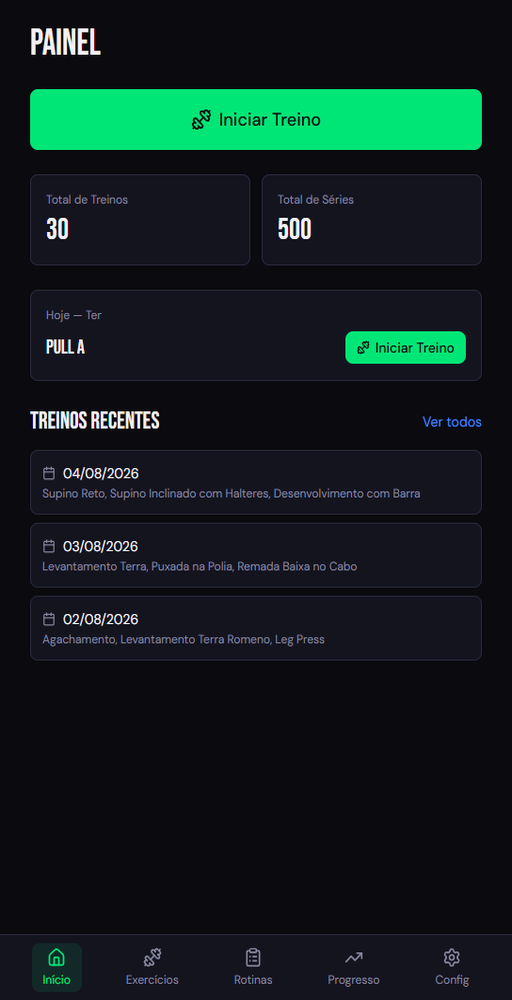
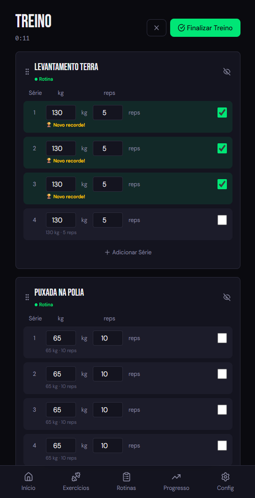
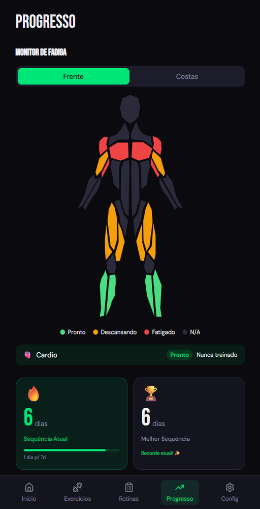
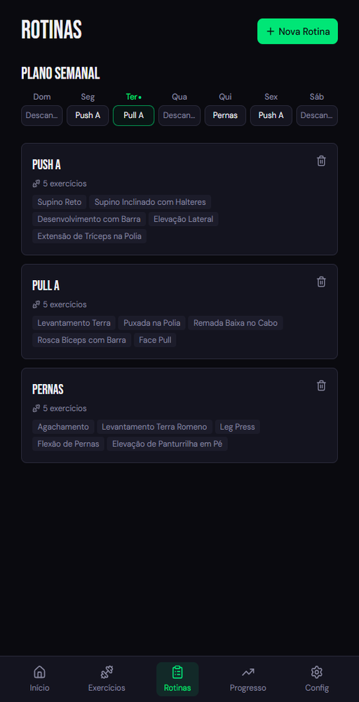
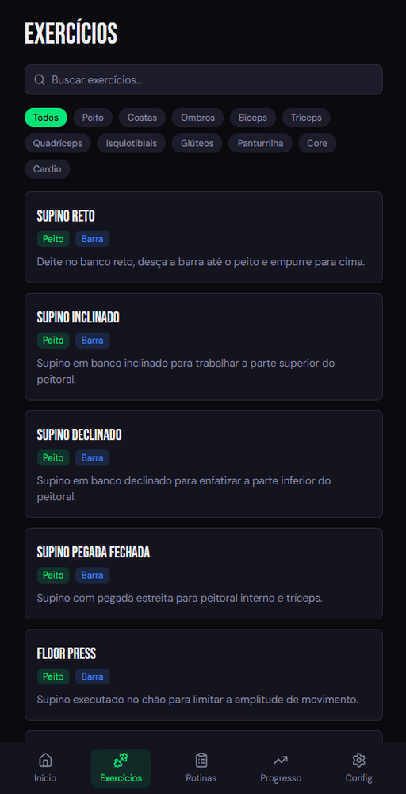

# Treinos

A workout tracking app built with React. Log exercises, track sets and weights, monitor streaks, and analyze progress over time.

**[Live demo →](https://gabrieelbrazao.github.io/gym-app/)** — installable as a PWA; all data stays in your browser.

<table>
  <tr>
    <td></td>
    <td></td>
    <td></td>
  </tr>
  <tr>
    <td align="center">Dashboard</td>
    <td align="center">Active workout</td>
    <td align="center">Progress</td>
  </tr>
  <tr>
    <td></td>
    <td></td>
    <td></td>
  </tr>
  <tr>
    <td align="center">Routines &amp; weekly schedule</td>
    <td align="center">Exercise library</td>
    <td></td>
  </tr>
</table>

## Features

- **202 exercises** organized by muscle group and equipment type
- **Custom routines** with per-exercise set/rep/weight configuration and per-set overrides
- **Weekly schedule** — assign routines to specific days
- **Live workout tracking** — log each set as you go, with a rest timer between sets
- **Drag-to-reorder** — reorder exercises in active workouts and routine editor
- **Previous session comparison** — ghost values (last weight × reps) shown per set; PR flash + confetti when a personal record is broken
- **Progress analytics** — streaks, totals, averages, most trained muscles, workout calendar
- **Muscle fatigue monitor** — tracks recovery status across muscle groups
- **PWA** — installable, works offline, auto-updates in the background

## Stack

| | |
|---|---|
| Framework | React 19 + TypeScript |
| Build | Vite 7 |
| Styling | Tailwind CSS v4 |
| Animations | Framer Motion |
| Drag & Drop | @dnd-kit |
| State | Zustand (localStorage persistence) |
| Routing | React Router v7 |
| Testing | Vitest + React Testing Library |

## Getting Started

```bash
npm install
npm run dev
```

The dev server runs with HTTPS via `@vitejs/plugin-basic-ssl` (required for PWA APIs on mobile).

## Scripts

```bash
npm run dev          # Dev server
npm run build        # Type-check + build
npm run preview      # Preview production build
npm test -- --run    # Run all tests once
npm run lint         # ESLint
```

## Project Structure

```
src/
├── pages/           # Dashboard, Exercises, Routines, ActiveWorkout, History, Progress
├── components/      # Layout, BottomNav, RestTimer, ExercisePicker, SetInput, ConfirmDialog, …
├── stores/          # useWorkoutStore, useHistoryStore, useRoutineStore, useScheduleStore
├── hooks/           # useWorkoutStats, useFatigue, useRestTimer, useStopwatch
├── data/
│   └── exercises.ts # 202 exercises with muscle groups and equipment
├── types/
│   └── index.ts     # TypeScript interfaces
├── lib/
│   └── motion.ts    # Shared Framer Motion variants
└── i18n/
    └── pt-BR.ts     # Portuguese translations
```

## Pages

| Route | Description |
|---|---|
| `/` | Dashboard — streak, stats, quick-start |
| `/exercises` | Exercise library with muscle group filter |
| `/routines` | Manage routines + weekly schedule |
| `/routines/new` | Create routine |
| `/routines/:id/edit` | Edit routine |
| `/workout` | Active workout session |
| `/history` | Past sessions |
| `/history/:id` | Session detail |
| `/progress` | Analytics and charts |

## Deploy

Pushes to `main` build with `GITHUB_PAGES=1` (which sets the `/gym-app/` base path) and publish to GitHub Pages via `.github/workflows/deploy.yml`.

## License

[MIT](LICENSE)
